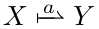
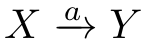
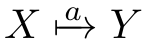
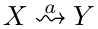
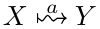
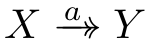
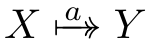

# fbarrows -- A package to draw "forward" and "backward" arrows 

This package provides macros for 8 different types of arrows: 

| Type                 | Without `\mapstochar`[^1] char | With `\mapstochar` char |
|----------------------|---------------------------------------------------|------------------------------------------------|
| Straight, half tip   |  |  |                                |
| Straight, full tip   |  |  |                         |
| Squigly, full tip    |  |  |                         |
| Straight, double tip |  |  |

Refer to `main.tex` for usage and how to reproduce those arrows in tiKz.

[^1]: Note that mapstochar does not seem to [exist in unicode](https://github.com/latex3/mathtools/issues/45).
